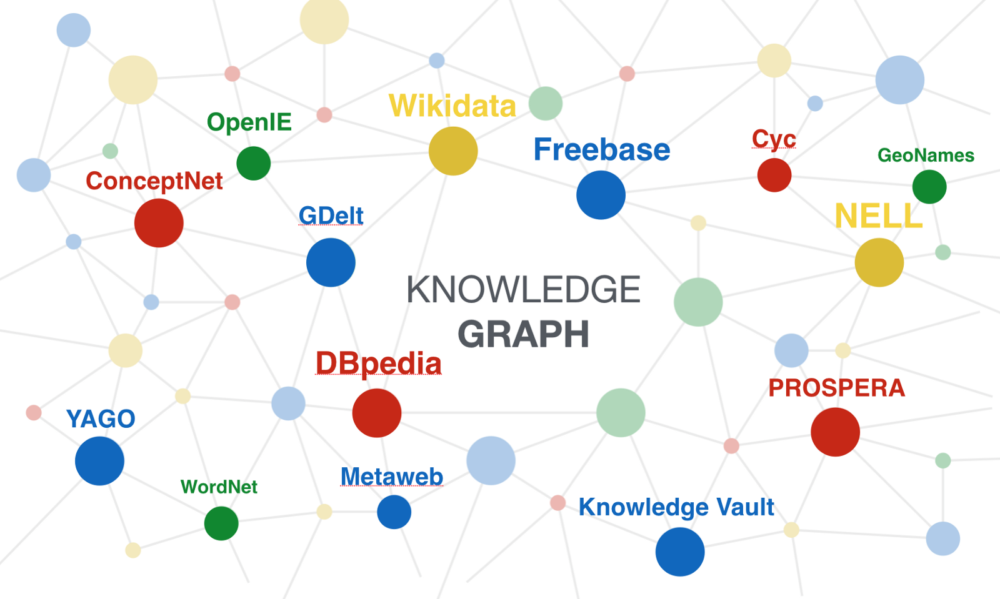

# Notes about *Semi-supervised classification with graph convolution networks* (Thomas N.Kipf, Max Welling)

## ABSTRACT

1. a scalable approach for semi-supervised learning on `graph-structured` data on an efficient variant of CNNs which operate `directly on graphs`.(! The approach proposed by this paper is only suitable on `structured data`, and it experiment on `citation networks and knowledge graph`)
    + 这篇论文着重点在于对`结构化数据`也就是能够直接表示成`图`的数据进行半监督学习的分类。其实验了几个数据集，都是`引文网络和知识图`

  

  

